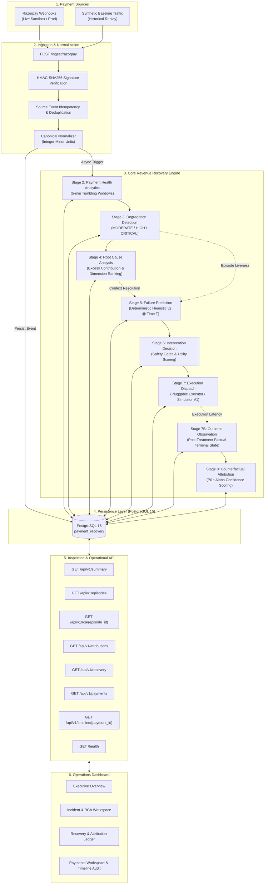

# Revenue Protection & Recovery Engine

> **Detect. Predict. Intervene. Recover.**

Payment failures should be treated as recoverable revenue opportunities, not just failed transactions.

The **Revenue Protection & Recovery Engine** is an end-to-end financial infrastructure system that monitors real-time payment health, isolates systemic degradation, predicts transaction-level failure probability, deterministically selects and executes recovery interventions, and calculates genuine recovered revenue using counterfactual causal attribution.

[](https://www.python.org/)
[](https://fastapi.tiangolo.com/)
[](https://www.postgresql.org/)
[](https://www.sqlalchemy.org/)
[](tests/)
[](#9-live-razorpay-validation)

---

## 1. Hero / Product Introduction

The **Revenue Protection & Recovery Engine** shifts payment management from passive transaction monitoring to active, closed-loop revenue recovery. Rather than recording payment failures as inevitable losses or triggering blind retries that aggravate degraded gateway infrastructure, the engine diagnoses root causes, estimates point-in-time failure risk, deploys targeted interventions, and causally attributes genuine recovered revenue.

### Project Status

- **Pipeline Architecture**: Complete, decoupled 8-stage revenue recovery pipeline with strict temporal causality.
- **Provider Ingestion**: Live Razorpay Sandbox webhook ingestion with HMAC-SHA256 signature verification and deterministic event deduplication.
- **Prediction Model**: Deterministic, auditable point-in-time scoring heuristic (`untrained-heuristic-v2`) with 30m-to-24h fallback windowing.
- **Intervention Execution**: Pluggable executor pattern currently backed by demonstration simulation infrastructure (`SimulatorInterventionExecutor` / `SIMULATOR_V1`).
- **Causal Attribution**: Formal counterfactual calculator enforcing temporal precedence and multi-factor confidence scoring.
- **Operator Interface**: Dedicated 4-workspace operational dashboard (Executive Overview, Incidents, Recovery, Payments) served directly from FastAPI.

---

## 2. The Problem

Payment failures cause direct, immediate gross merchandise value (GMV) loss and degrade customer trust. In high-velocity checkout environments, traditional payment infrastructure suffers from five systemic shortcomings:

1. **Passive Post-Mortem Observation**: Systems observe failures only after payment attempts terminate, alerting engineers via dashboards long after customers have abandoned carts.
2. **Blind, Uninformed Retries**: Payment systems retry failed transactions against the exact same failing payment gateway or degraded bank rail, aggravating gateway outages and multiplying customer friction.
3. **Absence of Root Cause Context**: Single-transaction retry logic lacks holistic awareness of whether failures stem from global network degradation, specific card issuer downtime, UPI provider instability, or customer card balance issues.
4. **Unjustified Intervention Costs**: Interventions (such as routing through alternative premium gateways or triggering instant payment links) carry execution costs and customer friction. Systems lack policy logic to determine whether an intervention is financially justified.
5. **Inability to Prove Value (Counterfactual Blindness)**: When a retried payment succeeds, traditional platforms claim 100% of the GMV as "recovered." In reality, many payments would have succeeded organically without intervention. Without counterfactual attribution, payment operations cannot prove actual return on investment.

```text
Traditional Approach:
[ Transaction Attempt ] ──> [ Fails ] ──> [ Blind Retry ] ──> [ Fails Again / Unmeasured ]

Revenue Recovery Approach:
[ Event Ingress ] ──> [ Health Analytics ] ──> [ Degradation RCA ] ──> [ Failure Prediction ]
        │
        ▼
[ Policy Decision ] ──> [ Targeted Intervention ] ──> [ Terminal Outcome ] ──> [ Causal Attribution ]
```

Predicting payment failure alone is insufficient. Real financial protection requires an automated closed-loop that detects degradation, diagnoses cause, decides intervention, executes corrective action, and causally proves revenue recovery.

---

## 3. The Solution

The Revenue Protection & Recovery Engine solves this problem through an unbroken, auditable feedback loop across 8 decoupled stages:

```text
Payment Event
    ↓
Stage 2: Payment Health Analytics
    ↓
Stage 3: Degradation Detection
    ↓
Stage 4: Root Cause Analysis (RCA)
    ↓
Stage 5: Failure Prediction
    ↓
Stage 6: Intervention Decision
    ↓
Stage 7: Intervention Execution
    ↓
Stage 7B: Payment Outcome Observation
    ↓
Stage 8: Counterfactual Attribution
    ↓
Protected / Recovered Revenue Ledger
```

### Core Differentiator

The engine **does not stop at predicting payment failure**. It actively closes the loop:
- It **detects** systemic and localized gateway degradations across tumbling time windows.
- It **identifies** the primary structural cause through excess failure distribution analysis.
- It **predicts** failure probability for incoming authorized transactions strictly using point-in-time data ($T$).
- It **evaluates** hard safety gates and utility curves to determine if active intervention is justified.
- It **executes** the optimal intervention route via an isolated execution layer.
- It **observes** the factual, terminal payment outcome when the provider reports capture or terminal failure.
- It **determines** whether the payment would have failed in the absence of intervention.
- It **attributes** recovered revenue only when strict temporal, causal, and evidence invariants are satisfied.

---

## 4. System Architecture

The engine is built around a single-process asynchronous FastAPI core backed by PostgreSQL 15, structured into clean architectural boundaries:



### Traceability and Data Flow
The architecture preserves an unbroken evidence chain from the raw webhook payload to the financial balance sheet. An operator or auditor can click any attributed transaction in the dashboard and inspect its complete chronological progression: the originating webhook, the health snapshot that captured the incident, the active degradation episode, the ranked candidate cause, the point-in-time feature snapshot, the decision score, the executed command, the factual outcome, and the mathematical attribution calculation.

---

## 5. The 8-Stage Engine

| Stage | Name | Core Purpose | Key Inputs | Key Outputs | Architectural Rationale |
|---|---|---|---|---|---|
| **Stage 1** | **Ingestion & Normalization** | Authenticate, parse, and normalize raw external payloads into canonical internal domain events. | Raw webhook HTTP payload, signature headers, `X-Razorpay-Event-Id`. | Canonical `PaymentEvent` (integer minor units, normalized UTC timestamps). | Eliminates provider-specific idiosyncrasies, guarantees idempotency, and prevents float rounding errors. |
| **Stage 2** | **Payment Health Analytics** | Aggregate transaction health across 5-minute tumbling windows and establish baselines. | Stream of canonical `PaymentEvent` records. | `PaymentHealthSnapshot` records (global & dimensional: bank, method, currency, wallet). | Transforms discrete events into continuous statistical health signals across segmented traffic slices. |
| **Stage 3** | **Degradation Detection** | Detect sustained failure spikes and manage degradation incident lifecycles. | `PaymentHealthSnapshot` sequences vs. historical baselines. | `DegradationEpisode` (`ACTIVE`, `RECOVERED`) with severity (`MODERATE`, `HIGH`, `CRITICAL`). | Isolates genuine systemic anomalies from short-lived, transient transaction noise. |
| **Stage 4** | **Root Cause Analysis (RCA)** | Diagnose the primary structural dimension responsible for an active incident. | Active `DegradationEpisode` and segmented snapshot failure rates. | `RCAEvaluation` with ranked `CandidateCause` entries and evidence strength (`STRONG`, `MODERATE`, `WEAK`). | Prevents blind global reactions by identifying exactly which dimension (e.g., `card`, `HDFC`, `INR`) is failing. |
| **Stage 5** | **Failure Prediction** | Compute point-in-time probability of transaction failure strictly as-of time $T$. | Canonical payment details, active episode context, and matching RCA candidate. | `FailurePrediction` (`failure_probability` in [0.0, 1.0], point-in-time features snapshot). | Quantifies risk per individual transaction before funds are lost, without future-data lookahead. |
| **Stage 6** | **Intervention Decisioning** | Evaluate policy utility and safety gates to choose the optimal recovery action. | `FailurePrediction`, policy rules, gateway costs, safety kill switches. | `InterventionDecision` (`ACT`, `MONITOR`, `NO_ACTION`, selected candidate route). | Decouples prediction from action; ensures interventions are only executed when economically justified. |
| **Stage 7** | **Intervention Execution** | Dispatch, execute, and monitor corrective action commands via pluggable executors. | `InterventionDecision` (`ACT`), command specifications, dispatch parameters. | `InterventionCommand` (`SUCCEEDED`, `FAILED`), execution attempt records, latency. | Isolates business decisioning from provider dispatch; tracks execution latency for causal timing. |
| **Stage 7B** | **Outcome Observation** | Observe and record the factual terminal state of the payment after treatment. | Terminal event (`payment.captured`, `payment.failed`), terminal timestamp. | `PaymentOutcomeObservation` (terminal status, terminal latency, validation flags). | Separates what *happened* to the payment from whether the intervention *caused* the outcome. |
| **Stage 8** | **Counterfactual Attribution** | Compute genuine protected GMV using multi-factor confidence and counterfactual math. | Prediction baseline $P_0$, intervention command, observation record, RCA evidence. | `CounterfactualAttribution` (`ATTRIBUTED`, `UNATTRIBUTED_*`, protected GMV, confidence score α). | Enforces the invariant that successful payments are not automatically recovered revenue. |

---

## 6. Prediction & Decision Logic

Failure prediction is executed by the `DeterministicBaselineModel` (model version: `untrained-heuristic-v2`).

### Why Heuristic-v2 is Deterministic
The prediction engine is deliberately designed as a transparent, auditable, and deterministic heuristic rather than a black-box machine learning model. In regulated financial recovery workflows, every probability assignment must be explainable during post-incident audits:

$$
\begin{aligned}
P_{\text{base}} &= 0.05 \\
P_{\text{blended}} &= 0.5 \times P_{\text{base}} + 0.5 \times R_{\text{historical}} \\
P_{\text{adjusted}} &= P_{\text{blended}} + \Delta_{\text{severity}} + \Delta_{\text{RCA}} \\
P_{\text{fail}} &= \min(1.0, \max(0.0, P_{\text{adjusted}}))
\end{aligned}
$$

### Failure Rate Blending & Fallback Behavior
The model adapts to shifting payment gateway reliability by evaluating recent global failure rates:
1. **Primary Window (30-minute)**: The model first queries `global_30m_failure_rate`.
2. **Fallback Window (24-hour)**: If the preceding 30-minute volume is insufficient or the window is unpopulated, the model automatically falls back to `global_24h_failure_rate`. Both windows apply the identical $0.5$ blending coefficient.
3. **Rationale**: Low-volume periods (e.g., overnight checkout windows or off-peak hours) must not cause the engine to discard valuable empirical baseline failure context.

### Additive Risk Coefficients

```text
Degradation Episode Severity:
├── CRITICAL (drop ≥ 0.30)  ──> +0.30
├── HIGH     (drop ≥ 0.20)  ──> +0.15
└── MODERATE (drop ≥ 0.10)  ──> +0.05

RCA Candidate Segment Match:
├── Segment matches payment & evidence is STRONG    ──> +0.20
└── Segment matches payment & evidence is MODERATE  ──> +0.10
```

### Probability Bounding
All predictions are strictly bounded to the interval $[0.0, 1.0]$. The model version string `untrained-heuristic-v2` is persisted alongside every prediction record to guarantee reproducible audits.

---

## 7. Intervention Decisioning

Prediction and intervention are strictly separated. A high failure probability identifies risk; it does not dictate that an intervention must occur. Stage 6 evaluates whether an intervention is safe, compliant, and cost-effective.

### Safety Evaluation Gates
Before evaluating utility, the engine passes the transaction through 5 deterministic safety gates:
1. **Feature Freshness**: Ensures the point-in-time feature snapshot timestamp is valid and non-stale.
2. **Administrative Kill Switches**: Verifies that automated interventions have not been paused globally or by payment method.
3. **Currency Allowance**: Validates that the transaction currency is permitted by policy (e.g., `INR` in standard catalog).
4. **Single-Intervention Invariance**: Guarantees that a payment attempt receives at most one intervention command, preventing infinite retry loops.
5. **Episode Liveness Matching**: Ensures that if an intervention requires an active incident, the associated degradation episode is still `ACTIVE`.

### Candidate Policy Routes
When gates pass, candidate routes are scored by expected recovery utility:

| Route Identifier | Expected Recovery Rate | Execution Cost (Minor Units) | Strategy Description |
|---|---|---|---|
| `RETRY_SECONDARY_GATEWAY` | 55% | 150 (₹1.50) | Re-route authorization request to backup acquiring bank. |
| `PROMPT_PAYMENT_METHOD_SWITCH` | 65% | 300 (₹3.00) | Trigger customer UI prompt suggesting UPI or alternative card. |
| `DYNAMIC_RETRY_BACKOFF` | 35% | 50 (₹0.50) | Apply exponential jittered backoff before re-attempting gateway. |
| `DEGRADATION_CIRCUIT_BYPASS` | 75% | 500 (₹5.00) | Bypass degraded intermediary switch directly to card network rail. |
| `FALLBACK_PAYMENT_LINK` | 45% | 200 (₹2.00) | Issue instant SMS/WhatsApp payment link for asynchronous completion. |

### Decision Thresholds
- **$P_{\text{fail}} \ge 0.70$ (`ACT`)**: Risk justifies active intervention. Dispatches command to Stage 7.
- **$0.35 \le P_{\text{fail}} < 0.70$ (`MONITOR`)**: Elevated risk observed; logged to telemetry without customer intervention.
- **$P_{\text{fail}} < 0.35$ (`NO_ACTION`)**: Transaction proceeds along default routing path.

> **Demonstration Infrastructure**: The current execution layer is backed by `SimulatorInterventionExecutor` (`SIMULATOR_V1`), which provides deterministic simulation for pipeline verification without executing live financial debit requests against banking partners.

---

## 8. Counterfactual Attribution

The engine enforces a rigorous technical distinction:

$$
\text{Successful Payment} \neq \text{Automatically Recovered Revenue}
$$

If a payment succeeds after an intervention was attempted, the engine does not automatically claim 100% of the transaction amount. Instead, it proves whether the intervention *caused* the recovery.

### Mandatory Attribution Criteria
For revenue to be classified as `ATTRIBUTED`, all of the following conditions must hold:
1. **Point-in-Time Prediction**: An audited failure probability $P_0$ was generated at transaction time $T$.
2. **Action Decision**: An explicit `ACT` decision was issued by the policy engine.
3. **Command Execution**: An intervention command was successfully dispatched and completed (`SUCCEEDED`).
4. **Factual Terminal Outcome**: The payment reached a final terminal state (`CAPTURED`).
5. **Temporal Precedence Invariant**:
$$
\text{Timestamp}(\text{Payment Captured}) \ge \text{Timestamp}(\text{Intervention Execution Completed})
$$
   *If a payment captures before the intervention finishes executing, the intervention cannot have caused the capture. The record is classified as `UNATTRIBUTED_UNTREATED`.*

### Mathematical Attribution Formula
Attributed protected revenue is calculated as:

$$
\text{Attributed Protected GMV} = \text{Amount} \times P_0 \times \alpha_{\text{confidence}}
$$

Where total causal confidence $\alpha_{\text{confidence}}$ is the product of three independent confidence penalties:

$$
\alpha_{\text{confidence}} = \max\left(0.25, \; c_{\text{prediction}} \times c_{\text{diagnosis}} \times c_{\text{timing}}\right)
$$

1. **Prediction Provenance ($c_{\text{prediction}} = c_{\text{provenance}} \times c_{\text{status}}$)**:
   - `EMPIRICAL_PRODUCTION`: $1.00$
   - `SYNTHETIC_DEVELOPMENT`: $0.60$
   - `UNKNOWN`: $0.30$
2. **Diagnostic Evidence ($c_{\text{diagnosis}}$)**:
   - `STRONG` RCA Evidence: $1.00$
   - `MODERATE` RCA Evidence: $0.85$
   - `WEAK` RCA Evidence: $0.70$
   - `NONE`: $0.60$
3. **Execution-to-Outcome Timing ($c_{\text{timing}}$)**:
   - Terminal event within $\le 60\text{ seconds}$: $1.00$
   - Terminal event within $\le 300\text{ seconds}$: $0.85$
   - Terminal event $> 300\text{ seconds}$: $0.60$

### Terminal Attribution Statuses
- `ATTRIBUTED`: All causal invariants satisfied; protected GMV recognized on ledger.
- `UNATTRIBUTED_UNTREATED`: Payment succeeded, but no intervention occurred or intervention completed after capture.
- `UNATTRIBUTED_PAYMENT_FAILED`: Intervention was executed, but the payment terminated in terminal failure.
- `UNATTRIBUTED_EXECUTION_FAILED`: The recovery command failed to execute.
- `INDETERMINATE_INSUFFICIENT_EVIDENCE`: Required point-in-time telemetry or baseline data was unavailable.
- `UNRESOLVED_IN_FLIGHT`: Payment remains authorized; awaiting terminal outcome.

---

## 9. Live Razorpay Validation

The complete 8-stage pipeline has been validated end-to-end against live Razorpay Sandbox webhooks.

### Validated Lifecycle Proof
Using an external tunnel (`ngrok`) and the Razorpay Webhooks dashboard:
1. **Webhook Ingestion**: Real `payment.authorized` and `payment.captured` webhooks entered via `POST /ingest/razorpay`.
2. **Signature Authentication**: Webhook payload verified with HMAC-SHA256 signature matching against `RAZORPAY_WEBHOOK_SECRET`.
3. **In-Flight Safety Invariant**: When `payment.authorized` was received:
   - Stage 2 aggregated metrics into the active 5-minute window.
   - Stage 3 evaluated degradation severity.
   - Stage 4 verified root cause evidence.
   - Stage 5 scored failure risk ($P_{\text{fail}} > 0.50$).
   - Stage 6 issued an `ACT` decision.
   - Stage 7 executed the intervention command.
   - **Crucial Invariant**: The authorized transaction was **not prematurely attributed**. Stage 8 remained idle because the payment was still in flight.
4. **Terminal Attribution Execution**: When the subsequent `payment.captured` webhook arrived:
   - Stage 7B observed the factual terminal outcome (`CAPTURED`).
   - Stage 8 evaluated temporal precedence ($\text{Capture Time} \ge \text{Command Time}$).
   - The payment was successfully marked as `ATTRIBUTED` with audited protected GMV.
5. **Terminal Failure Handling**: Real `payment.failed` webhooks were simultaneously ingested, normalized, and persisted to the database, surfacing in the Payments Workspace.

> **Git Audit Reference**: Commit `5697361 validate live Razorpay recovery attribution` verifies the full real-webhook bridge and test suite. No private credentials or live webhook secrets are committed to the repository.

---

## 10. Product UI

The engine includes a modern, dark-mode operational dashboard served directly by FastAPI at `http://localhost:8000`:

<!-- Add dashboard screenshot here: Executive Overview -->

### Dashboard Workspaces

| Workspace | Primary Purpose | Operator Telemetry & Visualizations |
|---|---|---|
| **Executive Overview** | Real-time financial protection & health telemetry. | - Database connectivity indicator (live `/health` polling).<br/>- Total processed GMV vs. Protected GMV.<br/>- Overall transaction capture rate.<br/>- Active degradation episodes counter.<br/>- Interactive causal recovery lifecycle narrative strip. |
| **Incidents & RCA** | Deep-dive root cause investigation. | - Degradation episodes table with live status (`ACTIVE`/`RECOVERED`).<br/>- Absolute failure rate drop and severity badges (`CRITICAL`, `HIGH`, `MODERATE`).<br/>- Episode detail inspection drawer with ranked candidate causes.<br/>- Excess failure contribution percentages and evidence strength tags. |
| **Recovery & Attribution** | Audit recovery actions & causal economics. | - Intervention Command Ledger (command ID, payment ID, route, execution status, latency).<br/>- Counterfactual Attribution Ledger (treatment status, failure probability P₀, confidence score α, calculated protected GMV).<br/>- Direct link to payment audit timeline. |
| **Payments Workspace** | Granular transaction audit & timeline trace. | - Filterable transaction list (`ALL`, `ATTRIBUTED`, `FAILED`, `CAPTURED`).<br/>- Payment ID search with instant filtering.<br/>- End-to-end chronological timeline drawer tracing Stage 1 through Stage 8. |

<!-- Add dashboard screenshot here: Payment Audit Timeline Drawer -->

---

## 11. API Surface

The engine exposes read-only inspection endpoints designed for operator dashboards, automated verification, and external monitoring:

| Method | Endpoint Route | Description & Telemetry Returned |
|---|---|---|
| `GET` | `/health` | DB-aware health check verifying active PostgreSQL connectivity (`SELECT 1`). |
| `GET` | `/api/v1/summary` | Executive summary metrics: total GMV, protected GMV, active episodes, successful interventions, overall capture rate. |
| `GET` | `/api/v1/episodes` | Bounded list of degradation episodes (supports `limit=100`, ordered descending by window start). |
| `GET` | `/api/v1/rca/{episode_id}` | Root cause evaluation for an episode: ranked candidate causes, excess contributions, evidence strengths, and downstream payment counts. |
| `GET` | `/api/v1/attributions` | Counterfactual attribution records (supports `limit=50`, ordered by evaluation time). |
| `GET` | `/api/v1/recovery` | Recovery intervention ledger with optional `decision_type` filter (`ACT`, `MONITOR`, `NO_ACTION`) and pagination (`limit`, `offset`). |
| `GET` | `/api/v1/payments` | Comprehensive payment ledger with search, status filters (`captured`, `failed`, `authorized`), and attribution filters (`ATTRIBUTED`). |
| `GET` | `/api/v1/timeline/{payment_id}` | Chronological end-to-end audit trace for an individual payment across all 8 stages. |
| `POST` | `/ingest/razorpay` | External webhook ingress validating `X-Razorpay-Signature` and triggering asynchronous recovery pipeline. |

---

## 12. End-to-End Traceability

Every financial recovery claim in the engine is anchored to an immutable identity chain:

```text
External Webhook
  │  (X-Razorpay-Event-Id, e.g., "event_N7x...")
  ▼
PaymentEvent (event_id: UUID, payment_id: "pay_N7x...")
  │
  ├──> PaymentHealthSnapshot (snapshot_id: UUID, window: 5-min)
  │      ▼
  │    DegradationEpisode (episode_id: UUID, severity: "CRITICAL")
  │      ▼
  │    RCAEvaluation (evaluation_id: UUID)
  │      ▼
  │    CandidateCause (candidate_id: UUID, dimension: "payment_method")
  │
  ├──> FailurePrediction (prediction_id: UUID, P_fail: 0.825, model: "untrained-heuristic-v2")
  │      ▼
  │    InterventionDecision (decision_id: UUID, type: "ACT", route: "FALLBACK_PAYMENT_LINK")
  │      ▼
  │    InterventionCommand (command_id: UUID, status: "SUCCEEDED")
  │      ▼
  │    InterventionExecutionAttempt (attempt_id: UUID, latency_ms: 12)
  │      ▼
  │    PaymentOutcomeObservation (observation_id: UUID, status: "CAPTURED")
  │      ▼
  └──> CounterfactualAttribution (attribution_id: UUID, status: "ATTRIBUTED", protected_gmv: ₹500.00)
```

This deterministic linkage guarantees that no protected revenue number can be recorded without pointing directly to the prediction, decision, execution attempt, and factual payment capture that justified it.

---

## 13. Data & Correctness Guarantees

The codebase enforces strict correctness and safety invariants:

- **Canonical Payment Identity**: Every payment maintains a single canonical `payment_id` across all stages, preventing cross-transaction misattribution.
- **Idempotent Ingestion**: Raw webhook event IDs (`source_event_id`) are unique-indexed; duplicate payloads are rejected with HTTP 409 without mutating state.
- **Financial Precision**: All monetary values are strictly modeled as 64-bit integer minor units (e.g., paise, cents) to prevent floating-point calculation drift.
- **Episode-Scoped RCA**: Root cause evaluations are strictly scoped to the time window of the target episode, eliminating cross-incident telemetry leakage.
- **Point-in-Time Prediction Boundaries**: Stage 5 feature reconstruction only accesses health snapshots and episodes active strictly at or before transaction time $T$. Future events are mathematically inaccessible.
- **Temporal Attribution Precedence**: Terminal payment capture must occur at or after intervention execution completion for causal attribution eligibility.
- **Captured vs. Attributed Distinction**: Organic captures are explicitly tagged as `UNATTRIBUTED_UNTREATED` rather than credited as recovered revenue.
- **Error Isolation**: Pipeline stage failures in background tasks log detailed diagnostics and roll back isolated transactions without compromising or dropping the ingested webhook record.
- **Safe Query Boundaries**: Inspection endpoints enforce explicit upper bounds (`ge=1, le=1000`) and offset pagination to prevent database memory exhaustion.
- **Database-Aware Health Check**: The `/health` endpoint executes an active query (`SELECT 1`) against PostgreSQL rather than reporting a superficial 200 OK.

---

## 14. Testing & Validation

The repository includes a comprehensive, multi-layer automated test suite with **271 passing tests**:

| Test Layer | Test Count | Scope & Coverage |
|---|---|---|
| **Unit Tests** (`tests/unit/`) | **167 tests** | Model heuristics, normalization, signature verification, RCA math, policy gates, and live pipeline bridges. |
| **Boundary Tests** (`tests/boundaries/`) | **21 tests** | AST-based architectural compliance tests enforcing zero LLM imports, no provider SDK leakage, and stage decoupling. |
| **API Tests** (`tests/api/`) | **24 tests** | HTTP route contracts, query parameter validation, 404/422 handling, and error response schemas. |
| **Integration Tests** (`tests/integration/`) | **59 tests** | End-to-end database persistence, transaction lifecycles, and temporal window evaluation. |
| **Total Test Suite** | **271 tests** | Collected and verified via Pytest. |

### Running the Safe Offline Test Suite
To run all 188 isolated unit and architectural boundary tests without requiring an active PostgreSQL database:

```bash
pytest tests/unit/ tests/boundaries/ -q
```
*Executes 188 tests in < 2 seconds.*

> **Database Safety Notice**: Integration tests (`tests/integration/` and `tests/api/`) connect to PostgreSQL on port 5433 and perform database writes. To avoid truncating or altering live demonstration data, run integration tests against a dedicated test database container rather than an active demonstration instance.

---

## 15. Quick Start

### Prerequisites
- **Python 3.11+**
- **Docker & Docker Compose**
- **Virtual Environment** (`venv` or `poetry`)

### Step 1: Clone and Setup Virtual Environment
```bash
git clone https://github.com/Krishiv-Mahajan/Revenue-degradation-recovery.git
cd Revenue-degradation-recovery

python3.11 -m venv .venv
source .venv/bin/activate
pip install -r <(poetry export --without-hashes)  # or poetry install
```

### Step 2: Configure Environment Variables
Copy the example environment configuration:
```bash
cp .env.example .env
```
Edit `.env` if necessary. Default configuration:
```env
RAZORPAY_WEBHOOK_SECRET=test_webhook_secret
```

### Step 3: Start PostgreSQL
Launch the PostgreSQL 15 container (mapped to host port 5433):
```bash
docker compose up -d
```
Verify PostgreSQL is ready:
```bash
docker ps
```

### Step 4: Run Database Migrations
Apply all schema migrations via Alembic:
```bash
alembic upgrade head
```

### Step 5: Run the End-to-End Demonstration
Execute the demonstration orchestrator to seed baseline traffic, simulate a severe payment method outage, and run the pipeline through all 8 stages:
```bash
PYTHONPATH=. python scripts/demo_orchestrator.py
```
*(To run against an existing database without resetting tables, append `--no-reset`)*.

### Step 6: Start the Application Server
Launch FastAPI with Uvicorn:
```bash
uvicorn src.main:app --host 0.0.0.0 --port 8000 --reload
```

### Step 7: Open the Operations Dashboard
Open your browser and navigate to:
```text
http://localhost:8000
```
Inspect the Executive Overview, degradation incidents, intervention ledger, and payment timelines.

### Step 8: (Optional) Connect Live Razorpay Sandbox Webhooks
To test real payment events:
1. Start an ngrok tunnel to port 8000:
   ```bash
   ngrok http 8000
   ```
2. In the Razorpay Dashboard (Settings → Webhooks), create a webhook targeting:
   `https://<your-tunnel-domain>.ngrok-free.app/ingest/razorpay`
3. Set the Webhook Secret to match your `RAZORPAY_WEBHOOK_SECRET` and enable `payment.authorized`, `payment.captured`, and `payment.failed`.
4. Generate current-time background degradation context:
   ```bash
   python scripts/generate_live_context.py --pm card --curr INR --seed 42
   ```
5. Trigger a card payment in the Razorpay Sandbox checkout and watch it progress through the live pipeline on the dashboard.

---

## 16. Project Structure

```text
Revenue-degradation-recovery/
├── docker-compose.yml              # PostgreSQL 15 container definition (port 5433)
├── alembic.ini                     # Alembic database migration configuration
├── pyproject.toml                  # Project dependencies and packaging metadata
├── README.md                       # Product documentation
├── migrations/                     # Alembic database migration revisions
│   ├── env.py
│   └── versions/
├── scripts/
│   ├── demo_orchestrator.py        # End-to-end reproducible demonstration orchestrator
│   └── generate_live_context.py    # Current-time context generator for live webhook testing
├── src/
│   ├── main.py                     # FastAPI application entrypoint & static mounts
│   ├── api/
│   │   ├── routes.py               # Razorpay webhook ingestion routes (/ingest/razorpay)
│   │   ├── inspection_routes.py    # Operational read-only inspection API (/api/v1/...)
│   │   └── dependencies.py         # Database session & service dependency injectors
│   ├── core/
│   │   ├── analytics/              # Stage 2: Payment health tumbling window analytics
│   │   ├── degradation/            # Stage 3: Degradation detection & episode lifecycles
│   │   ├── rca/                    # Stage 4: Root cause analysis & candidate ranking
│   │   ├── ml/                     # Stage 5: Deterministic baseline heuristic v2
│   │   ├── intervention/           # Stage 6: Decision service, safety gates, & policy routes
│   │   ├── execution/              # Stage 7 & 7B: Command execution & outcome observation
│   │   ├── attribution/            # Stage 8: Counterfactual causal attribution calculator
│   │   ├── normalizers/            # Canonical webhook payload normalizers (Razorpay)
│   │   └── services/               # Orchestration bridges (live_pipeline, feature_reconstruction)
│   ├── infrastructure/
│   │   ├── database.py             # SQLAlchemy async engine and sessionmaker
│   │   ├── models.py               # Declarative ORM models for all pipeline stages
│   │   └── repository.py           # Domain data access repositories
│   └── static/                     # Operations Dashboard assets (HTML5, Vanilla CSS, JS)
└── tests/
    ├── unit/                       # Isolated unit tests (167 tests)
    ├── boundaries/                 # Architectural decoupling & AST compliance tests (21 tests)
    ├── api/                        # HTTP route contract tests (24 tests)
    └── integration/                # Database persistence & lifecycle tests (59 tests)
```

---

## 17. Technology Stack

| Component | Technology | Rationale & Implementation Details |
|---|---|---|
| **Backend Core** | Python 3.11, FastAPI 0.104 | High-performance asynchronous API framework with native Pydantic validation. |
| **Web Server** | Uvicorn | ASGI production-grade web server. |
| **Database** | PostgreSQL 15 | Relational storage for transactional records, health snapshots, and attribution ledgers. |
| **ORM & Driver** | SQLAlchemy 2.0 Async, asyncpg | Non-blocking database I/O for concurrent webhook and query execution. |
| **Migrations** | Alembic | Version-controlled schema migrations for relational tables. |
| **Dashboard UI** | HTML5, Vanilla CSS, Modern JavaScript | Zero-framework, lightweight, high-performance operational interface. |
| **Payments** | Razorpay Sandbox API & Webhooks | Real-world webhook payload ingestion with HMAC-SHA256 signature verification. |
| **Test Suite** | Pytest, Pytest-Asyncio, HTTPX | 271 tests spanning unit, integration, boundary AST compliance, and API contracts. |

---

## 18. Production Readiness

We maintain an honest distinction between what has been implemented and what is required for multi-tenant enterprise deployment.

### Implemented & Validated
- [x] Complete, decoupled 8-stage recovery pipeline with strict temporal causality.
- [x] Real-time webhook ingestion with cryptographic signature validation.
- [x] Point-in-time failure prediction with historical rate fallback windowing.
- [x] Policy-driven decisioning with 5 deterministic safety gates.
- [x] Multi-factor counterfactual attribution ledger.
- [x] Full operational dashboard with real-time health indicator.
- [x] 271 automated tests across unit, boundary, API, and integration layers.

### Production Hardening Roadmap
- [ ] **Persistent Message Broker**: Replace FastAPI in-memory background tasks with a distributed message queue (e.g., Redis Streams or Apache Kafka) for guaranteed webhook delivery.
- [ ] **Distributed Stream Aggregation**: Migrate 5-minute tumbling health snapshots to distributed stream processing (e.g., Apache Flink) for horizontal scale.
- [ ] **Production Gateway Executors**: Implement live banking partner integrations beyond the current simulation executor (`SimulatorInterventionExecutor`).
- [ ] **Authentication & Authorization**: Add mTLS, OAuth2/JWT role-based access control to inspection endpoints.
- [ ] **Distributed Tracing & Metrics**: Integrate OpenTelemetry spans across stages and export Prometheus metrics for window health.
- [ ] **Rate Limiting & Tenant Scoping**: Implement token-bucket rate limiting on ingestion endpoints.

---

## 19. Roadmap

| Horizon | Category | Target Objective |
|---|---|---|
| **Near-Term** | **Feature Reconstruction** | Expand feature reconstruction coverage to include `BANK` and `WALLET` dimensions in episode context, and `CURRENCY` in RCA segment matching. |
| **Near-Term** | **Executor Ecosystem** | Add live provider adapters for Razorpay Optimizer, Stripe Smart Retries, and custom webhook dispatchers. |
| **Medium-Term** | **ML Model Pipeline** | Train and shadow-evaluate supervised gradient-boosted models against the deterministic heuristic baseline. |
| **Medium-Term** | **Reliability** | Introduce idempotent dead-letter queue (DLQ) replay for unparseable webhook payloads. |
| **Long-Term** | **Multi-Tenancy** | Partition health snapshots, episodes, and attribution ledgers across independent merchant accounts. |

---

## 20. Why This Project Matters

Payment failure is traditionally viewed as a cost of doing business. When a transaction fails, companies either write off the revenue or deploy aggressive, uncoordinated retry algorithms that alienate customers and overwhelm degraded banking switches.

The **Revenue Protection & Recovery Engine** reframes payment failure as an active revenue optimization problem. By combining real-time systemic health detection, transaction-level failure prediction, policy safety gates, and counterfactual attribution, it creates an intelligent, transparent protective barrier around digital revenue.

Most importantly, every rupee or dollar claimed by the engine is backed by an auditable, counterfactual proof:

```text
Protected GMV Entry #8f2a...
├── Payment: pay_N7x94aK1 (₹2,500.00)
├── Failure Risk at T: 82.5% (Critical Outage on Card Rail)
├── Action: Executed FALLBACK_PAYMENT_LINK (Cost: ₹2.00)
├── Outcome: Captured via alternate rail within 42s
├── Causal Confidence: 0.85 (High Timing & Strong Diagnosis)
└── Net Attributed Protected GMV: ₹1,753.12
```

The result is not a vanity metric or a theoretical model score—it is verifiable, protected revenue.
